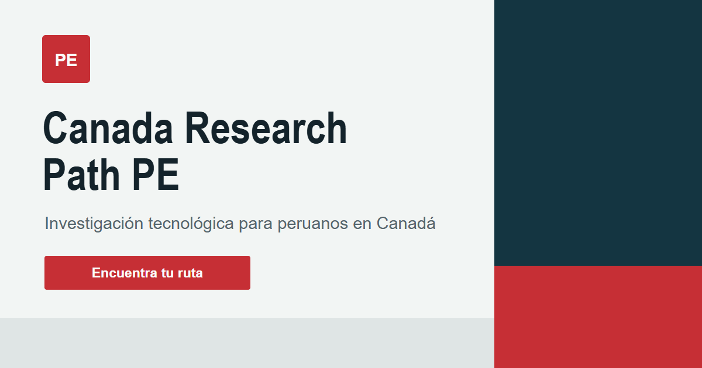

<div align="center">
  

  # Canada Research Path PE

  **Una ruta abierta y en español para investigación tecnológica entre Perú y Canadá.**

  Becas · pasantías · supervisores · laboratorios · preparación · contactos

  [](https://canada-research-path-pe.ridi-pillaca.chatgpt.site)
  [](data/)
  [](LICENSE)
</div>

---

## ¿Para quién es esta guía?

Para una persona peruana que quiere hacer investigación tecnológica en Canadá y necesita respuestas prácticas:

- ¿Qué programas existen para mi nivel?
- ¿Puedo postular desde mi universidad?
- ¿Necesito encontrar un supervisor primero?
- ¿Cuándo debo comenzar a prepararme?
- ¿Cuánto financiamiento ofrece cada ruta?
- ¿A quién puedo escribir?

El foco principal es **tech research**: IA, software, ciencia de datos, ingeniería, robótica, ciberseguridad y bioinformática. Algunas convocatorias aceptan otras disciplinas; el catálogo las conserva cuando ofrecen una ruta útil, pero la selección y las recomendaciones priorizan tecnología e investigación aplicada.

> [!IMPORTANT]
> Las fechas y reglas cambian. La guía ayuda a filtrar opciones, pero cada ficha lleva a la fuente oficial que debes revisar antes de postular.

## Dosier complementario

La carpeta [`dosier/`](dosier/) conserva material de análisis más extenso. Puede contener cifras o conclusiones de una etapa anterior que contradicen la guía principal; úsalo como referencia y aplica siempre la corrección más reciente respaldada por la fuente oficial.

| Archivo | Qué aporta |
|---|---|
| [`dossier-becas-canada.txt`](dosier/dossier-becas-canada.txt) | Lectura en texto plano, proceso de postulación y matriz de encaje. |
| [`matriz-elegibilidad.html`](dosier/matriz-elegibilidad.html) | Matriz interactiva complementaria. |
| [`dosier/en/`](dosier/en/) | Versiones complementarias en inglés. |

Cada afirmación del dosier usa marcadores de confianza: `[XX]` doble verificación, `[X ]` fuente única, `[~ ]` práctica general y `[!!]` no verificado.

## Empieza en tres pasos

### 1. Abre el buscador

Entra a **[canada-research-path-pe.ridi-pillaca.chatgpt.site](https://canada-research-path-pe.ridi-pillaca.chatgpt.site)**. No necesitas crear una cuenta.

### 2. Indica tu situación

Selecciona tu etapa académica, universidad actual y objetivo. La página no guarda ni envía tus respuestas.

### 3. Sigue el primer paso recomendado

Cada resultado explica el plazo, financiamiento, forma de postulación y la acción concreta que debes realizar ahora.

## Qué encontrarás

| Sección | Para qué sirve |
|---|---|
| **Encuentra tu ruta** | Filtra oportunidades compatibles con tu perfil. |
| **Calendario anual** | Sigue el avance del año y los intervalos para preparar, conectar, documentar, postular y viajar. |
| **Programas** | Compara Mitacs, ELAP, CGRS-D, becas universitarias y otras rutas. |
| **Universidades** | Identifica puertas institucionales y oficinas de movilidad. |
| **Cómo postular** | Organiza supervisor, documentos y calendario. |
| **Casos reales** | Aprende de estudiantes e investigadores peruanos publicados. |
| **Contactos** | Encuentra correos institucionales verificables. |
| **Recursos en Perú** | Conecta con InVivoLab, CONCYTEC, PROCIENCIA y redes relacionadas. |

## InVivoLab: recurso aliado

[InVivoLab](https://invivolab.org/) es un valioso directorio creado desde Perú para descubrir oportunidades STEM internacionales en Latinoamérica.

**Canada Research Path PE lo complementa** con:

- rutas específicas para personas peruanas;
- mayor profundidad sobre Canadá;
- énfasis en tecnología;
- preparación, contactos y casos públicos;
- una interfaz web y una CLI para agentes.

Este proyecto abre y atribuye InVivoLab. No copia ni redistribuye su base. Una sincronización automática requerirá autorización y una interfaz oficial acordada con su equipo.

[Explorar oportunidades en InVivoLab →](https://invivolab.org/oportunidades) · [Sugerir una oportunidad →](https://invivolab.org/sugerir)

## Otras versiones

- [Artefacto interactivo original en Claude](https://claude.ai/public/artifacts/2e416fde-6608-4e29-b054-38475d2c38e7). Se conserva como referencia del proyecto; para fechas vigentes y la corrección sobre SICS, consulta esta guía y sus fuentes oficiales.

## Descargar y usar sin conexión

Descarga [`dist/canada-research-path-pe.html`](dist/canada-research-path-pe.html) y ábrelo con doble clic. Es un único archivo autónomo con el catálogo incluido; no requiere instalación ni internet para navegar sus datos.

Los enlaces oficiales sí necesitan conexión.

## Editar sin saber programar

Toda la información principal está en archivos sencillos dentro de [`data/`](data/):

- [`opportunities.json`](data/opportunities.json): programas, fechas, requisitos y fuentes.
- [`stories.json`](data/stories.json): casos públicos de peruanos.
- [`contacts.json`](data/contacts.json): contactos institucionales publicados.
- [`timeline.json`](data/timeline.json): etapas, fechas y rangos de preparación del año.

Para corregir una entrada desde GitHub:

1. Abre el archivo correspondiente.
2. Pulsa el icono del lápiz **Edit this file**.
3. Modifica únicamente la información necesaria.
4. Añade o conserva una fuente oficial.
5. Pulsa **Propose changes** para enviar la mejora.

Lee la guía completa en [`CONTRIBUTING.md`](CONTRIBUTING.md).

## CLI para personas y agentes

La CLI consulta el mismo catálogo que la web. Requiere Node.js 20 o posterior y no instala dependencias.

```bash
# Ver rutas disponibles para Perú
node bin/canada-research-path.mjs list

# Consultar una ruta concreta
node bin/canada-research-path.mjs show elap

# Ver el calendario anual de preparación y postulación
node bin/canada-research-path.mjs timeline

# Buscar según un perfil
node bin/canada-research-path.mjs match \
  --level=pregrado \
  --institution=unalm \
  --goal=pasantia

# Obtener datos estructurados para un agente
node bin/canada-research-path.mjs match \
  --level=pregrado \
  --institution=unalm \
  --goal=pasantia \
  --json

# Abrir la referencia segura a InVivoLab
node bin/canada-research-path.mjs invivo --json
```

<details>
<summary><strong>Valores admitidos por la CLI</strong></summary>

| Opción | Valores |
|---|---|
| `level` | `secundaria`, `pregrado`, `egresado`, `maestria`, `doctorado`, `posdoctorado`, `investigador` |
| `institution` | `cientifica`, `unalm`, `otra` |
| `goal` | `pasantia`, `intercambio`, `pregrado-completo`, `maestria-completa`, `doctorado-completo`, `posdoctorado`, `empleo-investigacion` |

</details>

## Trabajar en el proyecto

```bash
# Ejecutar pruebas
npm test

# Validar los datos
npm run validate

# Crear el HTML autónomo
npm run build

# Abrir la web local en http://localhost:8765
npm run serve
```

GitHub Actions repite automáticamente las pruebas, la validación y la construcción en cada cambio.

## Estructura

```text
├── index.html          # Página publicada en GitHub Pages
├── app.js              # Interacción y presentación
├── data/               # Catálogo editable
├── lib/catalog.mjs     # Filtros y validación compartidos
├── bin/                # CLI para personas y agentes
├── scripts/            # Generador del HTML autónomo
├── dist/               # Archivo descargable
├── test/               # Pruebas del catálogo
└── docs/               # Diseño, arquitectura y operación
```

## Principios del proyecto

- **Primero Perú:** cada ruta explica si realmente aplica a una persona peruana.
- **Fuente antes que promesa:** fechas y requisitos deben apuntar a evidencia pública.
- **Siguiente paso claro:** cada ficha indica qué hacer ahora.
- **Datos abiertos:** la comunidad puede revisar y corregir el catálogo.
- **Privacidad:** no se recopilan respuestas, cuentas ni documentos personales.
- **Complementar, no duplicar:** se promueven recursos como InVivoLab desde su fuente original.

## Estado y vigencia

Última verificación editorial: **7 de septiembre de 2026**.

El catálogo contiene **12 rutas**, de las cuales **11 figuran como aplicables a Perú** bajo las condiciones descritas. Una ruta no elegible se conserva para evitar que una persona pierda tiempo siguiendo información anterior.

## Licencia y atribución

El código y el texto original se publican bajo [licencia MIT](LICENSE). Los nombres, marcas y materiales enlazados pertenecen a sus titulares. El proyecto es comunitario e independiente; no representa oficialmente a los programas ni instituciones mencionados.

---

<div align="center">
  Hecho para que la próxima persona peruana encuentre su camino con menos confusión.
</div>
